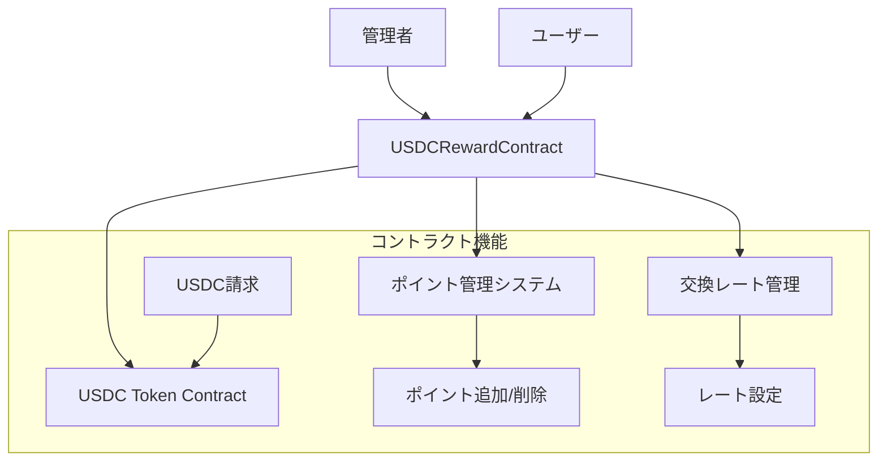

# 設計書

## 概要

USDC 報酬システムは、会話データをアップロードしたユーザーにポイントベースの報酬を提供するスマートコントラクトです。

管理者がユーザーのポイントを管理し、ユーザーがポイントを USDC に交換できる仕組みを実装します。

## アーキテクチャ

### システム構成



### 技術スタック

- **Solidity**: 0.8.28
- **フレームワーク**: Hardhat@2.26.1
- **ライブラリ**: OpenZeppelin Contracts v5.0.0
  - Ownable: アクセス制御
  - Pausable: 一時停止機能
  - ReentrancyGuard: リエントランシー防止
- **ネットワーク**: Base Sepolia (ChainID: 84532)
- **開発ツール**: Viem, TypeScript, Prettier

<br/>

すでに `contract` フォルダ配下にプロジェクトの基本的なセットアップは構築済みです。

この `contract` フォルダ配下のソースコードをベースにしてください。

## コンポーネントと インターフェース

### メインコントラクト: USDCRewardContract

#### 継承関係

```solidity
contract USDCRewardContract is Ownable, Pausable, ReentrancyGuard {
    // コントラクト実装
}
```

#### 状態変数

```solidity
// ユーザーのポイント残高
mapping(address => uint256) private pointBalances;

// ポイントからUSDCへの交換レート (1ポイント = exchangeRate USDC wei)
uint256 private exchangeRate;

// USDCトークンコントラクトのアドレス
IERC20 private usdcToken;
```

#### 主要関数

**管理者機能:**

```solidity
function addPoints(address user, uint256 amount) external onlyOwner
function transferPoints(address user, uint256 amount) external onlyOwner
function setExchangeRate(uint256 rate) external onlyOwner
function depositUSDC(uint256 amount) external onlyOwner
function withdrawUSDC(uint256 amount) external onlyOwner
function pause() external onlyOwner
function unpause() external onlyOwner
```

**ユーザー機能:**

```solidity
function claimUSDC(uint256 pointAmount) external whenNotPaused nonReentrant
function getPointBalance(address user) external view returns (uint256)
function calculateUSDCAmount(uint256 pointAmount) external view returns (uint256)
```

**内部関数:**

```solidity
function _transferUSDC(address to, uint256 amount) private
function _validateAddress(address addr) private pure
```

#### イベント

```solidity
event PointsAdded(address indexed user, uint256 amount);
event PointsTransferred(address indexed user, uint256 amount);
event ExchangeRateSet(uint256 newRate);
event USDCClaimed(address indexed user, uint256 pointsUsed, uint256 usdcAmount);
event USDCDeposited(uint256 amount);
event USDCWithdrawn(uint256 amount);
event ContractPaused();
event ContractUnpaused();
```

#### カスタムエラー

```solidity
error InsufficientPoints(uint256 required, uint256 available);
error InsufficientUSDCBalance(uint256 required, uint256 available);
error InvalidAddress();
error InvalidAmount();
error ExchangeRateNotSet();
error Unauthorized();
error ContractPaused();
```

## データモデル

### ポイントシステム

- **ポイント単位**: 1 ポイント = 最小単位
- **精度**: uint256（最大値まで対応）
- **管理**: mapping(address => uint256)で各ユーザーの残高を管理

### 交換レートシステム

- **レート表現**: 1 ポイント = exchangeRate USDC（wei 単位）
- **例**: exchangeRate = 1000000 の場合、1 ポイント = 0.001 USDC
- **デフォルト**: 0（設定されるまで交換不可）

### USDC トークン統合

- **トークン標準**: ERC20
- **Base Sepolia USDC**: 既存の USDC トークンコントラクトを使用
- **精度**: 6 桁（USDC の標準）

## エラーハンドリング

### 入力検証

1. **アドレス検証**: ゼロアドレスチェック
2. **金額検証**: ゼロ以下の値の拒否
3. **権限検証**: onlyOwner 修飾子による管理者権限チェック
4. **状態検証**: whenNotPaused 修飾子による一時停止状態チェック

### エラー処理戦略

1. **カスタムエラー使用**: ガス効率とデバッグ性の向上
2. **詳細なエラー情報**: 必要な値と利用可能な値を含む
3. **適切なリバート**: 状態変更前の検証

### セキュリティ対策

1. **リエントランシー防止**: OpenZeppelin の ReentrancyGuard を使用
2. **整数オーバーフロー**: Solidity 0.8.x の組み込み保護
3. **アクセス制御**: OpenZeppelin の Ownable を使用
4. **一時停止機能**: OpenZeppelin の Pausable を使用
   - ユーザー機能（claimUSDC）は一時停止時に無効
   - 管理機能は一時停止時も利用可能
5. **ゼロアドレス検証**: すべての関数でアドレス検証を実施
6. **ゼロ金額処理**: 適切なバリデーションとエラーハンドリング

## テスト戦略

### 単体テスト

1. **ポイント管理テスト**

   - ポイント追加の正常系・異常系
   - ポイント送金（transferPoints）の正常系・異常系
   - 残高不足時の処理
   - ゼロアドレス・ゼロ金額の処理

2. **交換レート管理テスト**

   - レート設定の正常系・異常系
   - 権限チェック
   - イベント発行確認

3. **USDC 請求テスト**

   - 正常な請求処理
   - 残高不足時の処理
   - コントラクト残高不足時の処理

4. **アクセス制御テスト**

   - 管理者権限の確認
   - 非管理者のアクセス拒否
   - 所有権移転

5. **エッジケーステスト**
   - ゼロアドレス処理
   - ゼロ金額処理
   - 一時停止状態での動作
   - リエントランシー攻撃の防止
   - 交換レート未設定時の動作

### 統合テスト

1. **USDC トークンとの統合**

   - トークン転送の確認
   - 残高更新の確認
   - イベント連携の確認

2. **エンドツーエンドフロー**
   - ポイント付与から USDC 請求までの完全フロー
   - 複数ユーザーでの同時操作
   - 大量データでの性能確認

### テストデータ

```solidity
// テスト用のサンプルデータ
address constant TEST_USER1 = 0x1234...;
address constant TEST_USER2 = 0x5678...;
uint256 constant INITIAL_POINTS = 1000;
uint256 constant EXCHANGE_RATE = 1000000; // 1ポイント = 0.001 USDC
uint256 constant USDC_DEPOSIT = 1000000000; // 1000 USDC
```

## デプロイメント設計

### コンストラクタパラメータ

```solidity
constructor(address _usdcToken) {
    usdcToken = IERC20(_usdcToken);
    owner = msg.sender;
    exchangeRate = 0; // 初期値は0（未設定）
}
```

### デプロイメント手順

1. **Base Sepolia USDC アドレスの確認**
2. **コントラクトのデプロイ**
3. **初期設定**
   - 交換レートの設定
   - 初期 USDC 供給
4. **権限設定の確認**
5. **テストネットでの動作確認**

### 設定管理

- **環境変数**: USDC_TOKEN_ADDRESS
- **ネットワーク設定**: hardhat.config.ts で管理
- **デプロイスクリプト**: Hardhat Ignition を使用

## タスク

`USDCRewardContract` コントラクトの機能が全て呼び出せるようにタスクを作成すること

タスクファイルは`tasks`配下に `usdcRewardContract` フォルダを作成し、そこに格納すること

## 監視とログ

### イベントログ

すべての重要な操作でイベントを発行し、フロントエンドやモニタリングシステムで追跡可能にします。

### メトリクス

1. **ポイント関連**

   - 総発行ポイント数
   - ユーザー別ポイント残高
   - ポイント使用履歴

2. **USDC 関連**

   - コントラクト内 USDC 残高
   - 総請求 USDC 量
   - 交換レート履歴

3. **システム関連**
   - アクティブユーザー数
   - 取引頻度
   - エラー発生率

## ドキュメント

- タスクの実行方法は READEME に記載すること
- セットアップ方法なども README に記載すること
- 誰がみてもわかりやすいように保守性の高いドキュメントにすること
