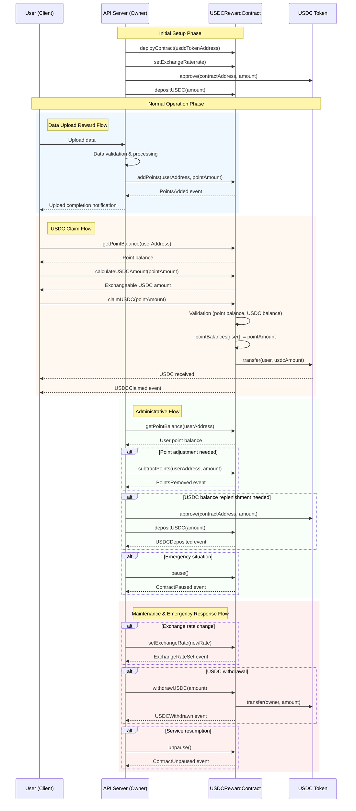

```mermaid
sequenceDiagram
participant User as User (Client)
participant API as API Server (Owner)
participant Contract as USDCRewardContract
participant USDC as USDC Token

    Note over API, Contract: Initial Setup Phase
    API->>Contract: deployContract(usdcTokenAddress)
    API->>Contract: setExchangeRate(rate)
    API->>USDC: approve(contractAddress, amount)
    API->>Contract: depositUSDC(amount)

    Note over User, USDC: Normal Operation Phase

    rect rgb(240, 248, 255)
        Note right of User: Data Upload Reward Flow
        User->>API: Upload data
        API->>API: Data validation & processing
        API->>Contract: addPoints(userAddress, pointAmount)
        Contract-->>API: PointsAdded event
        API-->>User: Upload completion notification
    end

    rect rgb(255, 248, 240)
        Note right of User: USDC Claim Flow
        User->>Contract: getPointBalance(userAddress)
        Contract-->>User: Point balance
        User->>Contract: calculateUSDCAmount(pointAmount)
        Contract-->>User: Exchangeable USDC amount
        User->>Contract: claimUSDC(pointAmount)
        Contract->>Contract: Validation (point balance, USDC balance)
        Contract->>Contract: pointBalances[user] -= pointAmount
        Contract->>USDC: transfer(user, usdcAmount)
        USDC-->>User: USDC received
        Contract-->>User: USDCClaimed event
    end

    rect rgb(248, 255, 248)
        Note right of API: Administrative Flow
        API->>Contract: getPointBalance(userAddress)
        Contract-->>API: User point balance

        alt Point adjustment needed
            API->>Contract: subtractPoints(userAddress, amount)
            Contract-->>API: PointsRemoved event
        end

        alt USDC balance replenishment needed
            API->>USDC: approve(contractAddress, amount)
            API->>Contract: depositUSDC(amount)
            Contract-->>API: USDCDeposited event
        end

        alt Emergency situation
            API->>Contract: pause()
            Contract-->>API: ContractPaused event
        end
    end

    rect rgb(255, 240, 240)
        Note right of API: Maintenance & Emergency Response Flow
        alt Exchange rate change
            API->>Contract: setExchangeRate(newRate)
            Contract-->>API: ExchangeRateSet event
        end

        alt USDC withdrawal
            API->>Contract: withdrawUSDC(amount)
            Contract->>USDC: transfer(owner, amount)
            Contract-->>API: USDCWithdrawn event
        end

        alt Service resumption
            API->>Contract: unpause()
            Contract-->>API: ContractUnpaused event
        end
    end
```
