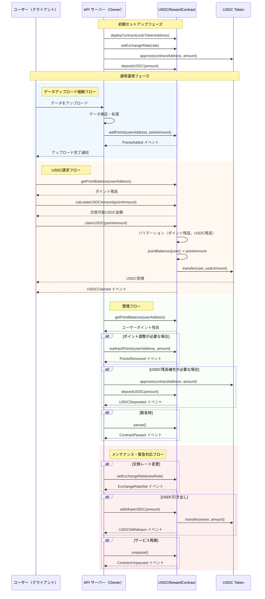

```mermaid
sequenceDiagram
participant User as ユーザー（クライアント）
participant API as API サーバー（Owner）
participant Contract as USDCRewardContract
participant USDC as USDC Token

    Note over API, Contract: 初期セットアップフェーズ
    API->>Contract: deployContract(usdcTokenAddress)
    API->>Contract: setExchangeRate(rate)
    API->>USDC: approve(contractAddress, amount)
    API->>Contract: depositUSDC(amount)

    Note over User, USDC: 通常運用フェーズ

    rect rgb(240, 248, 255)
        Note right of User: データアップロード報酬フロー
        User->>API: データをアップロード
        API->>API: データ検証・処理
        API->>Contract: addPoints(userAddress, pointAmount)
        Contract-->>API: PointsAdded イベント
        API-->>User: アップロード完了通知
    end

    rect rgb(255, 248, 240)
        Note right of User: USDC請求フロー
        User->>Contract: getPointBalance(userAddress)
        Contract-->>User: ポイント残高
        User->>Contract: calculateUSDCAmount(pointAmount)
        Contract-->>User: 交換可能USDC金額
        User->>Contract: claimUSDC(pointAmount)
        Contract->>Contract: バリデーション（ポイント残高、USDC残高）
        Contract->>Contract: pointBalances[user] -= pointAmount
        Contract->>USDC: transfer(user, usdcAmount)
        USDC-->>User: USDC受領
        Contract-->>User: USDCClaimed イベント
    end

    rect rgb(248, 255, 248)
        Note right of API: 管理フロー
        API->>Contract: getPointBalance(userAddress)
        Contract-->>API: ユーザーポイント残高

        alt ポイント調整が必要な場合
            API->>Contract: subtractPoints(userAddress, amount)
            Contract-->>API: PointsRemoved イベント
        end

        alt USDC残高補充が必要な場合
            API->>USDC: approve(contractAddress, amount)
            API->>Contract: depositUSDC(amount)
            Contract-->>API: USDCDeposited イベント
        end

        alt 緊急時
            API->>Contract: pause()
            Contract-->>API: ContractPaused イベント
        end
    end

    rect rgb(255, 240, 240)
        Note right of API: メンテナンス・緊急対応フロー
        alt 交換レート変更
            API->>Contract: setExchangeRate(newRate)
            Contract-->>API: ExchangeRateSet イベント
        end

        alt USDC引き出し
            API->>Contract: withdrawUSDC(amount)
            Contract->>USDC: transfer(owner, amount)
            Contract-->>API: USDCWithdrawn イベント
        end

        alt サービス再開
            API->>Contract: unpause()
            Contract-->>API: ContractUnpaused イベント
        end
    end

```
